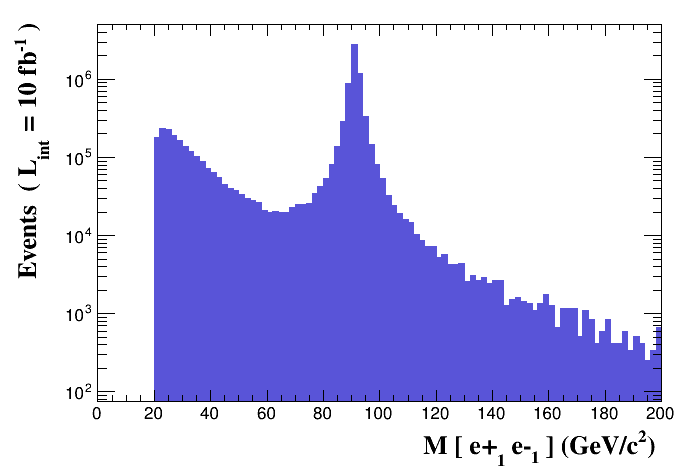
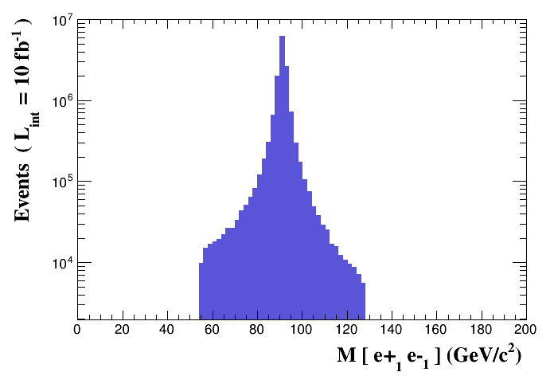
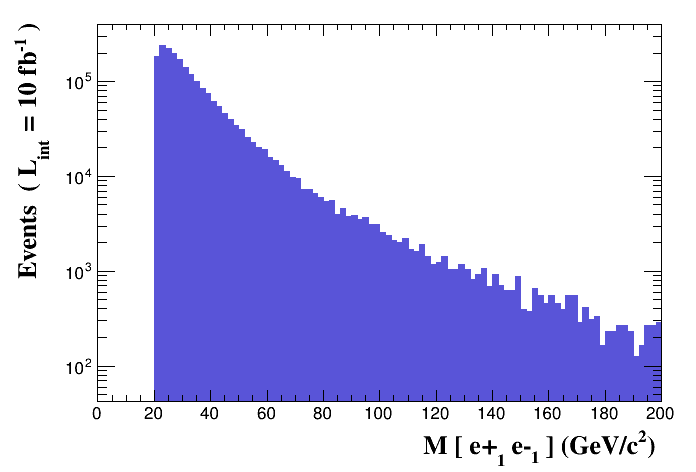
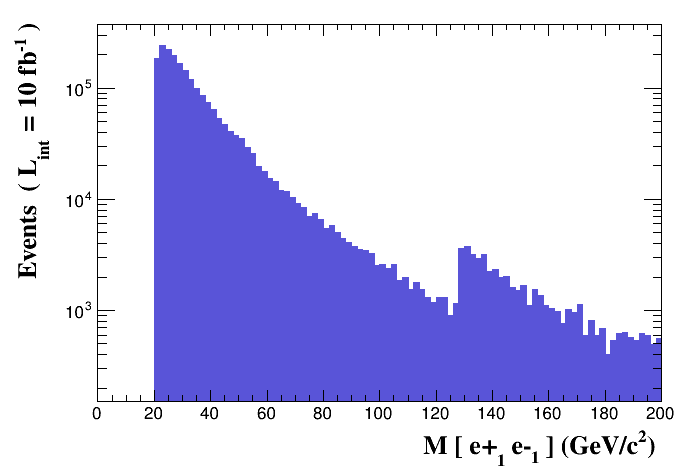
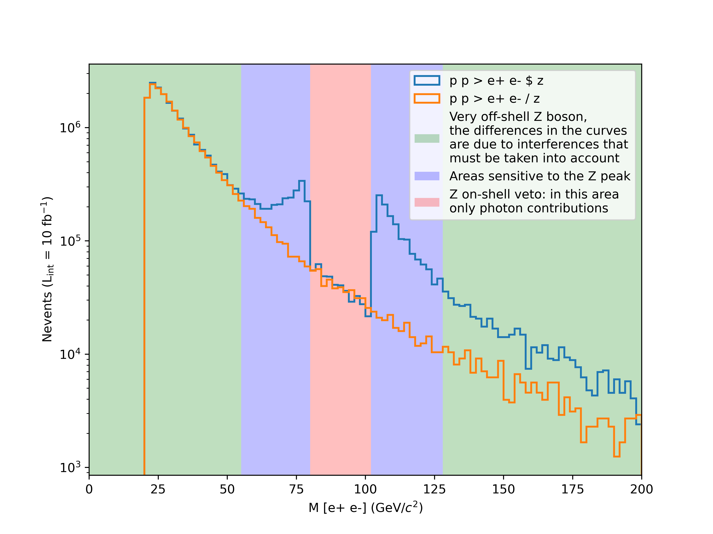

## Download and install
MadGraph is given *as is*, no proper installation is required.

### Software prerequisites
- Python 3.7+;
- Fortran compiler (`gfortran` v4.6+);
- other optional tools can then be installed through the MadGraph prompt.

### Installation
[Here you can find the official MadGraph repository](https://github.com/mg5amcnlo/mg5amcnlo).
You have two possibilities:
- clone the repository and checkout the latest version tag `v3.6.2`:
```bash
git clone --depth 1 --branch v3.6.2 https://github.com/mg5amcnlo/mg5amcnlo.git
```
- download a tarball and unpack it locally:
```bash
wget https://github.com/mg5amcnlo/mg5amcnlo/archive/refs/tags/v3.6.2.tar.gz
mkdir -p mg5amcnlo
tar xzf v3.6.2.tar.gz -C mg5amcnlo
```

Now `cd` into it:
```bash
cd mg5amcnlo
````
and explore the structure with `ls` or `tree` (if you have it installed):
```bash
ls -1
```
will return:
```
aloha
Analyses
bin
HELAS
input
INSTALL
LICENSE
madgraph
MadSpin
mg5decay
models
PLUGIN
README.md
Template
tests
UpdateNotes.txt
vendor
VERSION
```

Let's now study separately the folders:
- `bin`: it contains the main executable to run MadGraph: `mg5_aMC`;
- `input`: it contains the `mg5_configuration.txt` file, that specifies several general settings;
- `models`: there are already several models pre-installed, including the Standard Model (`sm`) and the Standard Model ready for NLO calculations (`loop_sm`), have a look at the file listings of each of them, you will find many python files, that are automatically written by Feynrules when exporting the model in UFO format;
- `PLUGIN`: this directory will contain any installed external plugins (we will have a look at it later in the hackaton).

## Start MadGraph
```bash
./bin/mg5_aMC
```
There is no need to start it from the same directory, and it is not
If you want a certain python version, then either use virtualenv, or specify python from the command line:
```bash
python ./bin/mg5_aMC
```
As you can see, MadGraph is a command-line tool, it has a prompt with tab-completion, waiting for your commands.

## Exercise 1: let's start the tutorial
Now type:
```
> tutorial
```
This will start the main tutorial and it will go through the main aspects of the code:
- how to generate a process;
- how to display the list of diagrams and processes;
- how to specify multiple processes;
- how to write a decay chain;
- how to export the process code;
- how to run/launch an event generation.

### Focus: the `display_diagrams` command
This command allows to display the different Feynman diagrams making up the process.
The resulting PDFs are saved in the system temporary folder (`/tmp` on Linux).
Notice that this command may not work on Windows Subsystem for Linux, without an X-server enabled.

> **TODO**  
> Explore this command for different processes.
> Try also `display_processes`.

### Focus: the `output` command
This command will create a folder with a certain name, in which it will save all the generated code (remember: MadGraph is a meta-code).
You can explore the folder by `cd`ing into it:
```
bin
Cards
Events
HTML
index.html
lib
madevent.tar.gz
MGMEVersion.txt
README
README.systematics
Source
SubProcesses
TemplateVersion.txt
```
where:
- `bin/generate_events` does the same as the `launch <this_folder>` from the main prompt;
- `Cards` contains the cards that can be modified also *offline*;
- `index.html` and `HTML` contain the website dashboard showing informations on the various runs;
- `lib`, `Source`, `SubProcesses` contain MadGraph internals;
- `madevent.tar.gz` contains the generated code in this folder: it is exactly a copy of this folder.

### Focus: particles and multiparticles
In MadGraph, each particle has a name, `a` is the photon, `g` the gluon, `c` the charm quark, `e+` the positron, `h` the higgs boson, ecc.
One can consider the related antiparticle by appending a `~` to the particle name, so that `t~` is the anti-top quark.
Additionally, when starting MadGraph a set of *multiparticles* is displayed: they are aliases referring to a set of different particles.
E.g. the proton is not an elementary particle, but one could define the multiparticle `p` to contain the set `g u c d s u~ c~ d~ s~`, meaning the lightest quarks and the gluon.
When generating processes, multiparticles are used so that the process generator will try any member of the multiparticle set when trying the processes, and if multiple multiparticles are specified in a single process generation, all the different combination in between their sets are tried.

## Exercise 2: Cards meaning
How do you change?
- top mass
- top width
- W mass
- beam energy
- pt cut on the lepton

> **TODO**  
> Try to change them!

> **TIP**  
> Cards parameter can be set via the `set` command during the question time, and tab-completion is enabled:
> ```
> set MT 170
> set ebeam 500
> ```

### Param card
The param card contains the various parameters that are settable according to the model: masses, couplings, and widths.

> **TODO**  
> Have a look at the `Cards/param_card.dat`

### Run card
The run card contains the parameters strictly related to the run: beams energies, cuts, and so on (even the run tag).

> **TODO**  
> Have a look at the `Cards/run_card.dat`

## Exercise 3: Syntax

- What is the meaning of the order QED/QCD?
- Learn the difference between:
    - `p p > t t~`
    - `p p > t t~ QED=2`
    - `p p > t t~ QED=0`
    - `p p > t t~ QCD^2==2`

> **TODO**  
> Generate `p p > t t~`, and do `display_diagrams`, is anything missing?

---

By default, MadGraph takes the lowest order in QED, so `p p > t t~` is equivalent to `p p > t t~ QED=0`.
While with `p p > t t~ QED=2` we have additional diagrams with photon/Z exchange.

> **TODO**  
> Generate the process `p p > t t~` with different QED orders and compute the cross-section.
> Is the QED contribution high?

Syntax `QED<=2` is **the same** as `QED==2`.
While `QCD^2==2` return the interference between the QCD and QED diagram.

> **TODO** 
> Try to compute it!

> **TODO**  
> Try to generate the following processes and observe the number of created diagrams in each case:
> - `p p > w+ w- j j`
> - `p p > w+ w- j j QED=2`
> - `p p > w+ w- j j QED=4`
> - `p p > w+ w- j j QCD=0`
> - `p p > w+ w- j j QCD=2`
> - `p p > w+ w- j j QCD=4`

### What is `WEIGHTED`
It is a label to indicate the maximum order of diagrams to generate, considering that:
- QCD: `WEIGHTED` is 1;
- QED: `WEIGHTED` is 2.

> **TODO**  
> Try to generate `p p > t t~ WEIGHTED=4`, and observe the diagrams.

## Exercise 4: Syntax

Generate the cross-section and the distribution (invariant mass) for:
- `p p > e+ e-`
- `p p > z, z > e+ e-`
- `p p > e+ e- / z`
- `p p > e+ e- $ z`

> **TIP**  
> To have automatic distributions, install MadAnalysis:
> ```
> mg5> install MadAnalysis5
> ```
> Then, generated plots are shown in the MadAnalysis card (and the prompt will now ask if you want to modify it), do the runs with sufficient number of events, like 100k, and generate the plot `M` from 0 to 200, with 100 bins:
> ```
> plot M(e-[1] e+[1]) 100 0  200 [logY ]
> ```
> Output plots can be found in `$PROC_DIR/HTML/run_<n>/tag_1_MA5_PARTON_ANALYSIS_analysis1/Output/PDF/MadAnalysis5job_0`.
> You may need Root:
> ```bash
> dnf install root
> ```

Syntax examples can be found at the following pages:
- <https://cp3.irmp.ucl.ac.be/projects/madgraph/wiki/InputEx>
- <http://madgraph.phys.ucl.ac.be//EXAMPLES/proc_card_examples.html>
- <https://cp3.irmp.ucl.ac.be/projects/madgraph/wiki/FAQ-General-6>
- <https://cp3.irmp.ucl.ac.be/projects/madgraph/wiki/FAQ-General-10>

### `p p > e+ e-`
We see the Z peak.


### `p p > z, z > e+ e-`
We see the Z peak.


The breadth of the distribution depends on the value of the Z width, and on the parameter `bwcutoff` of the run card (set to 15 by default), which is a cut on how far a particle can be off-shell.
$$
|M^\ast - M| < BW_\text{cut} \cdot \Gamma
$$

### `p p > e+ e- / z`
We don't see the Z peak, and we don't have photon/Z diagrams interference


Forbids any Z.

> **CAUTION**  
> Avoid this syntax, since it leads to a violation of gauge invariance.

### `p p > e+ e- $ z`
We don't see the Z peak, but we have photon/Z diagrams interference.


The `$` forbids the Z to be on-shell, but the photon invariant mass can be at $m_Z$.
This is basically a Z-on-shell veto, and only the photon is contributing in the $m_Z$ region.

### Note on the distribuition
Notice that the correct distribution is the one for `p p > e+ e-`, while we can also see that more or less the sum of:
- `p p > z, z > e+ e-`
- `p p > e+ e- $ z`

resembles it.

> [!CAUTION]
> Syntaxes like:
> - `p p > z > e+ e-` (ask one s-channel Z);
> - `p p > e+ e- / Z` (forbids any Z);
> - `p p > e+ e- $$ z` (forbids any Z in s-channel);
> 
> **are not gauge invariant, and can provide unphysical distributions**.
> Prefer the other syntaxes.
> 
> Indeed, let's have a look at the differences in the mass invariant distribution between the syntaxes `p p > e+ e- / z` and `p p > e+ e- $ z`: the first one will exclude the presence of the Z boson, so no interference is computed, while the second would just exclude on-shell Z boson in the range determined by the value of `bwcutoff`.
> Just to exaggerate the result, we will set `bwcutoff` to 5 (way to small for practical purposes), but it will show how different the tails would look like.
>
> 

## Exercise 5: Automation
Using the prompt is boring.
MadGraph provides a way to use scripts to automate the runs.
Basically, you write every command as a separate line in a text file, and MadGraph would execute them one after the other.
Whenever there are questions in the prompt, if the answer is not present, the default is taken automatically.
Comments are prepended with `#` (Python way).
Submit the script via:
```bash
./bin/mg5_aMC myscript.txt
```

> **TIP**  
> I like to keep *generate* and *launch* scripts separated, but one can write a single script performing both the process generation and the running.

### Example of a *generate* script
```
import model sm # notice that the sm is imported by default
generate p p > t t~
output mytestdir
```

### Example of a launch script
```
launch mytestdir # specify the name of the folder in the current cwd
set ebeam1 4000
set ebeam2 4000
set MT 170
launch # perform a second run
set MT 172
launch
set MT 174
launch
set MT 176
launch
set MT 178
launch
set MT 180
```

You can also specify the name of the run for each `launch`, so that you can track it down:
```
launch mytestdir -n run_MT170
set ebeam1 4000
set ebeam2 4000
set MT 170
launch -n run_MT172
set MT 172
launch -n run_MT174
set MT 174
launch -n run_MT176
set MT 176
launch -n run_MT178
set MT 178
launch -n run_MT180
set MT 180
```

> **TODO**  
> Open the `index.html` and track down the run results.

### Scan syntax
One can also use the `scan` syntax to perform automatic scans over multiple parameters in a single `launch`.
The scan syntax support python lists of floats, or even python list comprehension:
- `set MT scan:[170,172,174,176,178]`;
- `set MT scan:[170 + 2*i for i in range(5)]`.

#### Nested scan over multiple parameters
The following syntax:
```
set MT scan:[170,172]
set MH scan:[123,125,127]
```
Will scan over **all possible pairs** of `MT` and `MH` values.

#### Parallel scan over multiple parameters
The following syntax:
```
set MT scan1:[170,172]
set MH scan1:[123,125]
```
Will scan over **the parallel pairs** of `MT` and `MH` values.

## Exercise 6: Decay
Observe the following decay syntax:
```
generate p p > t t~ h, (t > w+ b, w+ > e+ ve), (t~ > w- b~, w- > e- ve~)
```
This will generate the first process, and then prepare the decay of the final states `t`, `t~`.

> **TODO**  
> Run the following:
> ```
> generate p p > t t~, t > w+ b, t~ > w- b~
> output
> launch
> set mt scan:range(170,181,2)
> ```
> And inspect the cross section.
> Why is it increasing?

This happens because the top width is kept fixed, however, its mass changes, so it needs to be updated: use `set wt auto` to take care of that automatically (only leading order contributions).

## Exercise 7: Gridpacks
When running `./bin/generate_events`, MadGraph automatically recompiles the code inside the folder for the set of parameters and settings that have been chosen in the cards.
However, this implies that this is done every run and it can be quite time-consuming, especially if we consider that most of MadGraph jobs are splitted across a grid of machines.
Additionally, the interactive approach, despite the usage of automation script, is a non-trivial overhead for large-scale production.
For this reason, MadGraph has the possibility to create a packaged version of the generated code that contains all the binaries already compiled, includes all the settings and parameters set, and that is ready to be shipped on grid workers, hence the name: **gridpack**.

To generate a gridpack, set the option from the run card when running `./bin/generate_events`:
```
set gridpack True
```
At the end of the run, that will not produce any events, you will have a new archive inside the main process folder named as `run_XX_gridpack.tar.gz`.
You can move the archive in another location and unpack it.
It will produce:
- the folder `madevent` containing the compiled code and all the files useful to run the event generation;
- the file `run.sh`, an executable script that requires two arguments: the number of events to generate and the random number generator seed.

> **TODO**  
> Run `run.sh` and see what happens.

Running `run.sh` will produce the `events.lhe.gz` file in the current working directory.

## Exercise 8: Where are the results?

### Where are the output files?
Each run done with `./bin/generate_events` will create a folder inside `Events` named after the run number (or the name passed by the `-m` option of the `launch` command).
That folder contains a file *banner* which will report the cross section result along with a dump of both the Param and Run cards.

### LHE file
Both runs with `./bin/generate_events` and with gridpacks will produce a file containing the generated events in the [Les Houches Event file](https://arxiv.org/abs/hep-ph/0609017) (LHE) format, which is the current standard to store process and event information from parton-level event generators.
The file contains an header with the generator and model information (basically a dump of the Param and Run cards) followed by the events record, containing multiple blocks.
Each event is a list of particles and each particle is represented by the sequence of the following attributes: `ID`, `status`, `mother1`, `mother2`, `color`, `anticolor`, `px`, `py`, `pz`, `E`, `mass`, `lifetime`, and `spin`, e.g.:
```
-11  1    3    3    0    0 -2.3393803385e+01 -7.4187481776e+00 -1.5274153214e+02 1.5470062541e+02 0.0000000000e+00 0.0000e+00 1.0000e+00
```
This line tells you that a positron (`-11`) is an outgoing particle (`1`) with Z as its mother (`mother1` and `mother2` are pointing to the 3rd - `3` - particle of the same record, which is a Z boson - `ID` is 23), with no color (`color` and `anticolor` are both 0), and the following four-momentum, mass, lifetime (it is stable) and spin.
