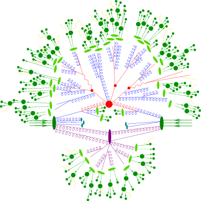

MadGraph is a Monte-Carlo event generator for high-energy physics.
It has been built to start from generic models (in *Unified FeynRules Output* - UFO format, see the [FeynRules model database](https://cp3.irmp.ucl.ac.be/projects/feynrules/wiki/ModelDatabaseMainPage)), and to *write* customized code on the basis of the processes that one wants to study.
MadGraph is indeed an **automatic meta-code** that writes the code for computing the cross-section and generating events for any process at colliders.

## Master formula of LHC

For Hadron colliders, we have:
$$
\sigma = \sum_{a,b} \int dx_1 dx_2 d\Phi f_a(x_1, \mu_F) f_b(x_2, \mu_F) \hat{\sigma}_{ab \to X}(s, \mu_F, \mu_R)
$$

### Parton-level cross section
Where the **parton-level cross section** is $\hat{\sigma}_{ab \to X}(s, \mu_F, \mu_R)$: it can be computed as a series in perturbation theory, expanding by the coupling constant:
$$
\hat{\sigma} = \sigma_\text{Born} \bigg( 1 + \frac{\alpha_\text{s}}{2\pi} \sigma^{(1)} + \Big(\frac{\alpha_\text{s}}{2\pi}\Big)^2 \sigma^{(2)} + \Big(\frac{\alpha_\text{s}}{2\pi}\Big)^3 \sigma^{(3)} + ... \bigg)
$$

The terms are, respectively: the Born amplitude (usually known as Leading-Order), the Next-to-Leading order (NLO) correction, the Next-to-NLO (NNLO) correction, the N3LO correction, etc.
The theoretical uncertainties (factorization and renormalization scales) can be reduced by including higher order corrections.

### Parton distribution functions (PDFs)
The PDFs are the functions $$f_a(x_1, \mu_F)$$ and $f_b(x_2, \mu_F)$, they parametrize the *content of the proton* (which is in general very "messy").
They are tabulated and there are a lot of them: usually experiments are using their proper PDFs.
The term $x_i$ is the momentum fraction of that proton component in the proton, according to the PDF.

### Phase-space integral
The integration is done over the momentum fractions $x_i$ and over the phase space $\Phi$, which represents the total amount of physical momentum configurations that the process can have.

## Steps to calculate the process
MadGraph does the following automatically, with very few user inputs.

The MadGraph event generator is called `madevent`.

### Determine the production mechanism
This part is done by generating the Feynman diagrams for each process.

### Evaluate the matrix element
The matrix element is built by using the Feynman rules, that are model dependent.
If there are multiple Feynman diagrams with the same initial and final states, they interfere.
E.g, for $e^+ e^- \to \mu^+ \mu^-$ we can have two Feynman diagrams, with either a photon (`a` in MadGraph) or a Z boson in s-channel.
In this case we need to compute:
- $\lvert M_{a} \rvert ^2$
- $\lvert M_{Z} \rvert ^2$
- $2 Re(M_a M_Z^\ast)$

So, for $n$ Feynman diagrams, we would need to compute $n^2$ interference terms.
The more the diagrams, the more the contributions to compute: it does not scale well, especially because the number of diagrams scales **factorially** with the number of particles.
However, we can stop one step before: instead of explicitly computing the sum over the helicities of the particles participating in the diagram, which is the correct thing to do if we want to obtain each one of the terms listed before, we can obtain the helicity-dependent amplitude, which allows us to obtain $M_a$ and $M_Z$, that then we can use to *assemble* both the interference terms and the squared-terms.
This allows us to compute one amplitude for each diagram.
However, this imply we need to keep track of the helicities when generating the matrix-element, and so we have additional initial states to keep into account (each particle brings a new helicity index).
Additionally, it is possible to recycle some of the computation, because the structure of the helicity amplitudes may be similar across different diagrams.
This is done by the HELAS library (Original HELicity Amplitude Subroutine library).
To translate from the FeynRules-syntax (UFO) to the helicity, the library ALOHA has been built.

### Phase-space integration
The calculation of cross section or decay widths involve integrations over high-dimension phase space of very peaked function:
$$
\sigma = \frac{1}{2s} \int |\mathcal{M}|^2 d\Phi(n)
$$
with $\text{Dim}[\Phi(n)]$ has dimension $3n$.

We use Monte-Carlo methods to evaluate integrals.
The advantage of Monte-Carlo with respect to other techniques is the fact it's variance depends solely on the number of generated events and not on the dimensionality of the problem.
For integration in multiple dimensions, this is much better than applying the trapezium or Simpson rule.

#### Importance sampling
It is the technique used so that the random points extraction happens in the more peaked regions of the parameter space, and not uniformly.
This helps into generating more events where the function *matters more*.
In practice, we are generating points according to a distribution that is more similar to the function we want to integrate.

#### VEGAS
VEGAS is an algorithm that performs *Adaptive Monte-Carlo*, so it creates an approximation of the function on the flight.
That approximation is then used to perform importance sampling.

##### Spin-off: MADNIS
In adaptive Monte-Carlo, VEGAS is *learning* a function: the MADNIS project is implementing this possibility using machine learning techniques.
