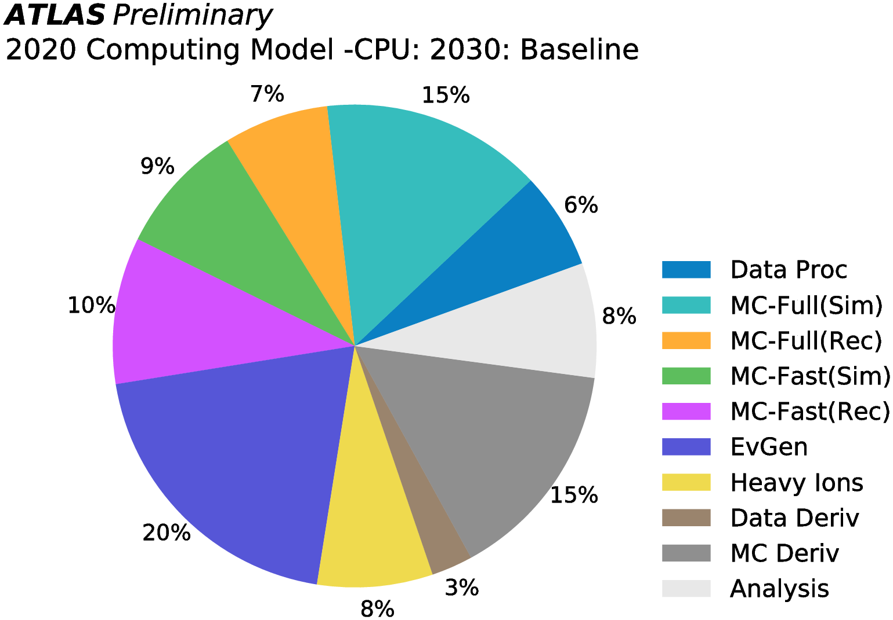
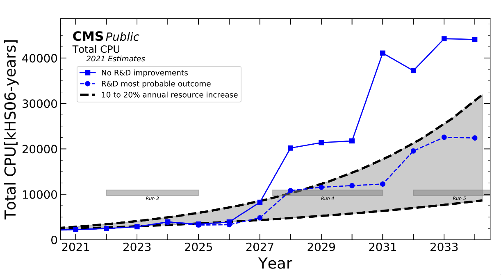
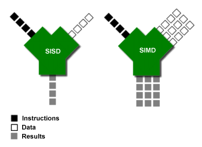
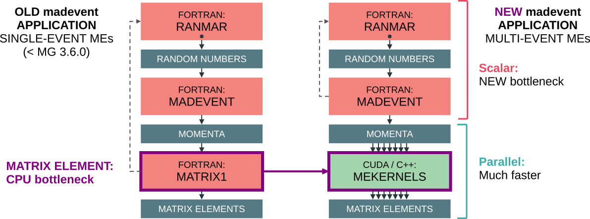

## Motivations
The recent estimation of the required computing resources for HL-LHC states event generation will allocate around **20%** of the total.
See indeed the following plots.

From: [ATLAS HL-LHC Computing Conceptual Report (2020)](https://cds.cern.ch/record/2729668)


From: [CMS Phase-2 Computing Model: Update Document](https://cds.cern.ch/record/2815292)


Predicted CPU resources are not enough to cover experiments needs.
One of the possible solution is to exploit hardware acceleration, in particular to work with new hardware like GPU, or to implement techniques to exploit the vectorization capabilites of CPUs.

## Sequential vs data-parallel processing
Look at the following picture, showing the difference in between two ways of processing data, part of the Flynn Taxonomy:
- Single Instruction Single Data (SISD);
- Single Instruction Multiple Data (SIMD).



In a SISD design, a single uni-core processor executes a single instruction stream, to operate on data stored in a single memory.
This corresponds to the von Neumann architecture.

In a SIMD design, computers with multiple processing elements perform the same operation on multiple data points simultaneously.
The data-parallesism is used (lockstep processing): data are distributed across several processors.
Note that the instructions are *parallel*, but not *concurrent*, meaning that each subprocess executes the **same** task on a slice of the data.
CPU vectorization is an example of SIMD.
Additionally, there is also the Single Instruction Multiple Threads (SIMT) design, which implies parallel simultaneous hardware-level execution, which is what happens in GPUs.

## MadGraph new architecture
MadGraph is a *meta*-code, so it writes other code.
So far, it writes code in FORTRAN, C, C++.
In order to implement SIMD concepts in MadGraph, new code written using C++ vectorization or GPU code has been added.

The first effort in porting the code to hardware acceleration has been done by understanding what was the main bottleneck.
Profiling the code showed that the matrix element evaluation was the part in which most of the time was spent during event generation.
That part of the code was so rewritten allowing the utilization of CPU vectorization and GPU code (CUDA, for NVIDIA GPUs, or HIP, for AMD GPUs).

The new architecture is shown in the following image (credits to Andrea Valassi).


## The CUDACPP plugin
These efforts have been coded in a MadGraph plugin called CUDACPP and available at the following [GitHub repository](https://github.com/madgraph5/madgraph4gpu).
The plugin adds two new output modes:
- `madevent_gpu` to run processes on GPUs (so far only NVIDIA and AMD);
- `madevent_simd`: to run processes using CPU vectorized instructions.

Additionally, a new option in the `run_card.dat` allows selecting the computation backend: `cudacpp_backend` that accepts the following values:
- `cuda`/`hip`: respectively NVIDIA/AMD GPU;
- `fortran`: FORTRAN CPU version (rewritten to accomodate the changes brought in by the CUDACPP plugin);
- `cpp`: it is an alias for `cppauto`;
- `cppnone`: implementation in C++ without vectorization;
- `cppsse4`, `cppavx2`, `cpp512y`, `cpp512z`: CPU implementation in C++ with vector instructions, by varying the different architectures:
    - `cppsse4`: SSE4.2 with 128 width (`xmm` registers): 2 double-precision floating point numbers;
    - `cppavx2`: AVX2 with 256 width (`ymm` registers): 4 double-precision floating point numbers (DEFAULT for `clang`);
    - `cpp512y`: AVX512 with 512 width (`ymm` registers): 8 double-precision floating point numbers (default for `gcc`);
    - `cpp512z`: AVX512 with 512 width (`zmm` registers): 8 double-precision floating point numbers;
- `cppauto`: the *best* vectorization available (one option is picked among the previous, on the basis of the system architecture and other machine features).

## Exercises
### Installation: the MadGraph plugins system
MadGraph supports external plugins that enhance its capabilities.
Each plugin can be installed using the `install` command.

The CUDACPP plugin can be installed automatically with:
```
mg5> install cudacpp
```
The plugin is then stored in the `$MADGRAPH_FOLDER/PLUGIN`.

> [!TIP]
> Try to press double-TAB to activate shell completion after the `install` command: a lot of different tools can be installed, among which `lhapdf6`, `pythia`, and several other libraries, that can be used in combination with MadGraph.

### Using MadGraph on GPU/CPU with vectorized instructions

#### Run on GPU
Requires a working installation of CUDA, with `nvcc` available in path (set both `PATH`, and `LD_LIBRARY_PATH` accordingly, see [here](https://docs.nvidia.com/cuda/cuda-installation-guide-linux/index.html#post-installation-actions)).
```
import model sm
generate p p > t t~ j
output madevent_gpu PROC_pp_ttxj_gpu
launch PROC_pp_ttxj_gpu
set cudacpp_backend cuda
```
#### Run on CPU with vector instructions
```
import model sm
generate p p > t t~ j
output madevent_simd PROC_pp_ttxj_simd
launch PROC_pp_ttxj_simd
set cudacpp_backend cppavx2
```

> [!TODO]
> For a more complicated process, you can try to increase the number of jets: `p p > t t~ j j` and so on.
> Beware, compilation times are gonna increase as well.

> [!TODO]
> Try out the CUDACPP plugin by running some of the processes studied in the [MadGraph hands-on](./day_1.md).

### The performance of the new `madevent`: a look at the internals
So, let's explore the internals and have a look at where the `madevent` generator is created.
There is one executable for each created subprocess, and this is created during the compilation time, and stored in each subprocess folder.
The process folder contains the `SubProcesses` directory, which contains directories of the kind `P<n>*` that represent each subprocess.
Notice two things:
- the root of `SubProcesses` contains several files, they are pretty much all symlinked inside each of the `P<n>*` folders: those are all the files to build the `madevent` executable, this also means that if we need to make changes to any makefile, we can do that in the main from the main `SubProcesses` folder;
- each `P<n>*` is made of the label of the subprocess it refers to, e.g., `P1_gg_ttxgg` is the subprocess of `p p > t t~ j j` represented by the process `g g > t t~ g g`.

The first compilation of the subprocesses should be done by running `./bin/generate_events`, so that all jobs for each subprocess are created.
Then, in each `P<n>*` folder, multiple subfolders `G<n>` would be created, each one containing a certain parametrization of the parameter space.
Additionally, they contain the file `input_app.dat` that listes the standard input to give to the `madevent` executable.
The latter is created in each `P<n>*` folder, and it will be a symlink to the `madevent_<backend>` executable.

One can then run something like:
```bash
./madevent < G<n>/input_app.dat
```
to run the MadEvent generator for a certain subprocess for one of the phase space parametrizations.

The code is instrumented so that running MadEvent in this way will also show the throughput and the timing spend in the calculation of the matrix element and in the still existent FORTRAN overhead.
